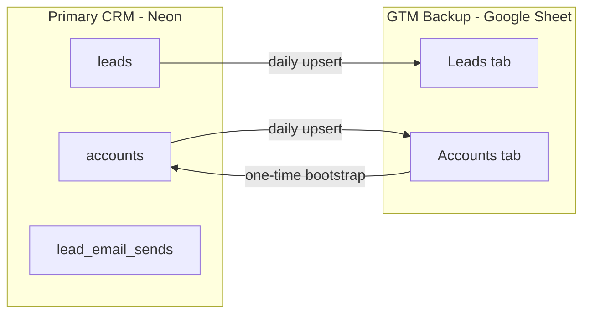

# RevForgeHQ CRM — Neon Postgres + Google Sheet Backup

Operational guide for the RevForgeHQ CRM. **Neon Postgres is the primary CRM.** A Google Sheet is the GTM-facing backup for filters, sharing, and manual review.

Full outreach/send path: **[GTM.md](GTM.md)**

## Architecture



| System | Role |
|--------|------|
| **Neon Postgres** | Source of truth — leads, accounts, send log, sync metadata |
| **Google Sheet** | GTM backup / export — human-friendly views, sharing with partners |
| **Cloudflare Pages** | Daily cron + manual `/api/crm/sync` pushes Neon → Sheet |

### Sync rules

- **Direction:** Neon → Sheet only (after initial account import)
- **Conflict resolution:** Neon wins — sheet cells are overwritten on upsert
- **Deletes:** never — rows that exist in only one system are kept
- **Schedule:** daily at 03:00 UTC (`wrangler.toml` cron)

## Spreadsheet

- **Name:** RevOps Target Companies - MarTech AdTech SalesTech V2
- **URL:** https://docs.google.com/spreadsheets/d/16lpxRX-flWP_blM_Rvq-_rc6ktZFUvBpjqp7eCmLtWs
- **Spreadsheet ID:** `16lpxRX-flWP_blM_Rvq-_rc6ktZFUvBpjqp7eCmLtWs`
- **Tabs:** `Accounts` (gid `466934255`), `Leads`

Share the spreadsheet with your Google **service account** email as **Editor** (required for Cloudflare sync).

## Database tables

Apply schemas in order:

```bash
export DATABASE_URL='postgresql://...'
psql "$DATABASE_URL" -f scripts/sql/leads_schema.sql
psql "$DATABASE_URL" -f scripts/sql/crm_schema.sql
```

| Table | Purpose |
|-------|---------|
| `leads` | People — outreach targets, tiers, email, LinkedIn |
| `accounts` | Target companies — segment, tier, domain |
| `lead_email_sends` | Postmark send log |
| `crm_sync_runs` | Sync job history |
| `crm_sync_state` | Watermarks for incremental lead sync |

**Join key:** `leads.company_key` ↔ `accounts.company_key` (lowercase trimmed company name).

## Column mapping

### Leads tab (Neon → Sheet)

| Neon field | Sheet column |
|------------|--------------|
| `id` | Lead ID |
| `first_name`, `last_name`, `full_name` | First Name, Last Name, Full Name |
| `company`, `title` | Company, Job Title |
| `linkedin_url`, `email` | LinkedIn URL, Email |
| `domain` (from accounts join) | Company Domain |
| `gtm_tier`, `gtm_tier_reason` | GTM Tier, GTM Tier Reason |
| `lead_source`, `outreach_status` | Lead Source, Outreach Status |
| `tier`, `score` | Adobe Tier, Score |
| `updated_at` | Last Synced At |

### Accounts tab

**Bootstrap (Sheet → Neon, one time):** flexible header matching for Company, Domain, Segment, Tier, Status, Notes. Unmapped columns stored in `accounts.extra` JSONB.

**Ongoing (Neon → Sheet):**

| Neon field | Sheet column |
|------------|--------------|
| `id` | Account ID |
| `company_name` | Company Name |
| `domain` | Domain |
| `segment` | Segment |
| `tier` | Tier |
| `status` | Status |
| `notes` | Notes |
| `updated_at` | Last Synced At |

Mapping source of truth: [`scripts/lib/crm_sheet_mapping.py`](../scripts/lib/crm_sheet_mapping.py) and [`functions/lib/crm-sheet-mapping.ts`](../functions/lib/crm-sheet-mapping.ts).

## One-time setup

### 1. Google Cloud

1. Enable **Google Sheets API** on your GCP project
2. Create a **Service Account** and download JSON key
3. Share the spreadsheet with `client_email` from the JSON as Editor
4. Store the JSON as `GOOGLE_SERVICE_ACCOUNT_JSON` (single-line string in Cloudflare; file path or raw JSON locally)

### 2. Bootstrap accounts from sheet

```bash
pip install -r scripts/requirements-neon.txt

python scripts/import_accounts_from_sheet.py --dry-run
python scripts/import_accounts_from_sheet.py
```

### 3. Backfill GTM tiers on leads

```bash
python scripts/classify_leads_gtm.py --write-db
```

### 4. First sheet sync (local)

```bash
python scripts/sync_crm_to_sheet.py --full --dry-run
python scripts/sync_crm_to_sheet.py --full
```

~32k leads — first full sync may take several minutes.

### 5. Cloudflare env vars

| Variable | Purpose |
|----------|---------|
| `GOOGLE_SERVICE_ACCOUNT_JSON` | Service account credentials |
| `CRM_SPREADSHEET_ID` | `16lpxRX-flWP_blM_Rvq-_rc6ktZFUvBpjqp7eCmLtWs` |
| `CRM_SHEET_LEADS` | Tab name (default: `Leads`) |
| `CRM_SHEET_ACCOUNTS` | Tab name (default: `Accounts`) |
| `LEADS_API_KEY` | Auth for `/api/crm/sync` (same as leads API) |
| `DATABASE_URL` | Neon connection string |

Add to **Workers & Pages → Settings → Environment variables** (production).

## API

All endpoints require `Authorization: Bearer <LEADS_API_KEY>`.

### Trigger sync manually

```bash
curl -X POST -H "Authorization: Bearer $LEADS_API_KEY" \
  "https://www.revforgehq.com/api/crm/sync"

# Full sync (ignore watermark)
curl -X POST -H "Authorization: Bearer $LEADS_API_KEY" \
  "https://www.revforgehq.com/api/crm/sync?full=true"

# Leads or accounts only
curl -X POST -H "Authorization: Bearer $LEADS_API_KEY" \
  "https://www.revforgehq.com/api/crm/sync?leads_only=true"
```

### Sync status

```bash
curl -H "Authorization: Bearer $LEADS_API_KEY" \
  "https://www.revforgehq.com/api/crm/sync"
```

Returns the latest row from `crm_sync_runs`.

## Scripts

| Script | Purpose |
|--------|---------|
| `scripts/import_accounts_from_sheet.py` | One-time Sheet → Neon accounts import |
| `scripts/sync_crm_to_sheet.py` | Local Neon → Sheet sync (mirrors Cloudflare) |
| `scripts/classify_leads_gtm.py --write-db` | Backfill `gtm_tier` on leads |
| `scripts/sql/crm_schema.sql` | Accounts + sync metadata tables |

## Local dev auth note

Cursor **gdrive MCP** uses OAuth (user credentials) for reading sheets during development. **Cloudflare production** uses a **service account**. Both need Sheets API enabled and spreadsheet access.

## What is not synced

- Send history (`lead_email_sends`) — query Neon or use `/api/leads/:id`
- Deletes — orphaned sheet rows are intentional (upsert-only policy)
- Sheet edits back into Neon — Neon is authoritative after account bootstrap
